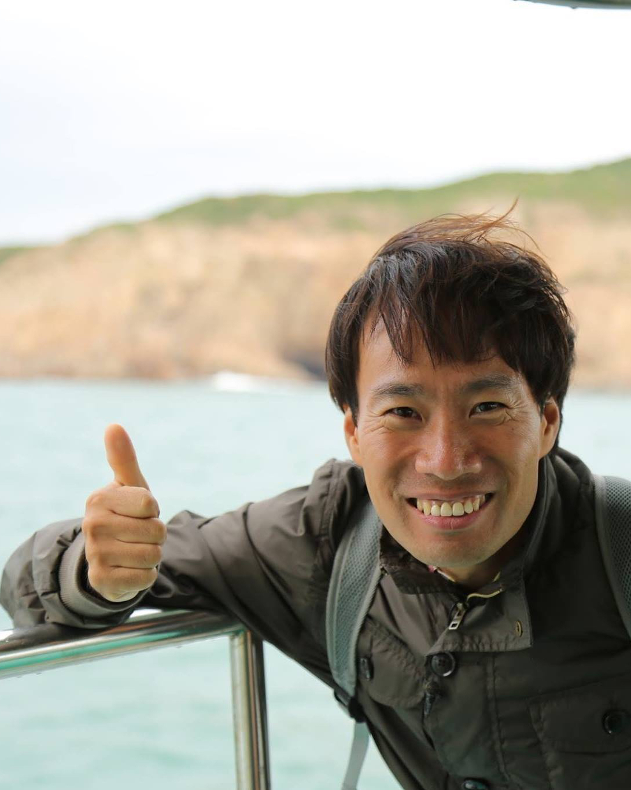
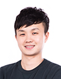

# 네이버 AI 해커톤 2018 - "한계를 넘어 상상에 도전하자!"

## Team : 슈퍼갤럭시 
<b>Member : 김민태, 오영택 </b>

---

## 대회 결과
||||
||||
||||
* [네이버 지식iN 질문 유사도 예측 문제 최종결과](res/result_kin_final.png)
* [네이버 영화 평점 예측 최종결과](res/result_movie_final.png)

## 모델 공유

<table>
  <tr>
    <th style="text-align:left;width:20%">팀명</th>
    <th style="text-align:left;width:40%">미션</th>
    <th style="text-align:left;width:40%">링크</th>
  </tr>
  <tr>
    <td>
      HongTeam
    </td>
    <td>
      네이버 영화 평점 예측
    </td>
    <td>
      <a href="https://github.com/grohong/ML/blob/master/Mid%20Report.pdf">바로가기</a>
    </td>
  </tr>
  <tr>
    <td>
      tantara
    </td>
    <td>
      네이버 영화 평점 예측
    </td>
    <td>
      <a href="https://github.com/tantara/naver-ai-hackathon-2018">바로가기</a>
    </td>
  </tr>
  <tr>
    <td>
      ToMuchInfo
    </td>
    <td>
      네이버 영화 평점 예측
    </td>
    <td>
      <a href="https://github.com/dreamgonfly/ToMuchInfo">바로가기</a>
    </td>
  </tr>
  <tr>
    <td>
      Hermits
    </td>
    <td>
      네이버 영화 평점 예측
    </td>
    <td>
      <a href="https://github.com/GzuPark/naver-ai-hackathon-2018/tree/master/libs">바로가기</a>
    </td>
  </tr>
</table>

> ※ 모델을 공유하실 팀은 PR 부탁드립니다.

## 멘토
여러분들과 함께 문제 해결 방법을 고민하고 조언 해주실 슈퍼 멘토를 소개합니다.

<table>
  <tr style="background-color:#fff">
    <td style="text-align:center">
      <br>
      김성훈
    </td>
    <td style="text-align:center">
      <br>
      곽동현
    </td>
    <td style="text-align:center">
      <br>
      서민준
    </td>
    <td style="text-align:center">
      <br>
      송현제
    </td>
    <td style="text-align:center">
      <br>
      최경호
    </td>
  </tr>
</table>

## 참가 신청
AI로 문제를 해결하는 데 관심 있는 분이라면 누구나 참가 신청할 수 있습니다.<br>
<strong>개인 또는 팀(최대 3명)</strong>으로 참가 가능합니다. [네이버 폼](http://naver.me/GyfLHzwg)으로 참가 신청하세요!

* **신청기간**: 2018년 3월 12일(월)~3월 25일(일)
* **참가 신청 폼**: 참가 신청 마감
* 신청자가 많을 경우 심사 후 개별 안내

## 일정
<table class="tbl_schedule">
  <tr>
    <th style="text-align:left;width:50%">일정</th>
    <th style="text-align:center;width:15%">기간</th>
    <th style="text-align:left;width:35%">장소</th>
  </tr>
  <tr>
    <td>
      <strong>참가 신청</strong><br>
      2018년 3월 12일(월)~3월 25일(일)
    </td>
    <td style="text-align:center">2주</td>
    <td>
      참가 신청 마감
    </td>
  </tr>
  <tr>
    <td>
      <strong>예선</strong><br>
      2018년 4월 2일(월)~4월 16일(월)
    </td>
    <td style="text-align:center">2주</td>
    <td>
      온라인<br>
      <a href="https://hack.nsml.navercorp.com">https://hack.nsml.navercorp.com</a>
    </td>
  </tr>
  <tr>
    <td>
      <strong>결선</strong><br>
      2018년 4월 26일(목)~4월 27일(금)
    </td>
    <td style="text-align:center">1박 2일</td>
    <td>
      네이버 커넥트원(춘천)<br>
    </td>
  </tr>
</table>

> ※ 예선 및 결선 참가자에게는 개별로 참가 안내드립니다.<br>
> &nbsp;&nbsp;&nbsp;결선 참가자는 네이버 본사(그린팩토리, 분당)에 모여서 커넥트원(춘천)으로 함께 이동하며<br>
&nbsp;&nbsp;&nbsp;네이버 본사 - 커넥트원 간 이동 차량 및 결선 기간 중 숙식, 간식 등을 제공합니다.

## 미션
* [네이버 지식iN 질문 유사도 예측](missions/kin.md)
* [네이버 영화 평점 예측](missions/movie-review.md)

> ※ 모든 미션은 NSML 플랫폼을 사용해 해결합니다.<br>
> &nbsp;&nbsp;&nbsp;NSML을 통해 미션을 해결하는 방법은 이 [튜토리얼](missions/tutorial.md)을 참고해 주세요.

## 진행 방식 및 심사 기준

### 예선

* 예선 참가자에게는 예선 기간 중 매일 오전 11시에 600 NSML 크레딧을 지급합니다.
* 팀 참가자일 경우 대표 팀원에게만 지급합니다.
* 사용하지 않는 크레딧은 누적됩니다.

#### ***예선 1라운드***
* 2018년 4월 2일(월) ~ 2018년 4월 9일(월) 오전 11시
* NSML 리더보드 순위로 2라운드 진출자 선정. 순위가 낮으면 자동 컷오프.

#### ***예선 2라운드***
* 2018년 4월 10일(화) 오전 11시 ~ 2018년 4월 16일(월) 오전 11시
* NSML 리더보드 순위로 결선 진출자 선정

### 결선
* 2018년 4월 26일(목) ~ 4월 27일(금) 1박 2일 동안 진행
* 결선 참가자에게는 1440 + α NSML 크레딧을 지급합니다.
* NSML 리더보드 순위로 최종 순위를 결정합니다.

> ※ 1 NSML 크레딧으로 NSML GPU를 1분 사용할 수 있습니다.<br>
> &nbsp;&nbsp;&nbsp;10 NSML 크레딧 = GPU 1개 * 10분 = GPU 2개 * 5분 사용

> ※ 예선, 결선 진출자는 개별 안내 드립니다.


## 시상 및 혜택

* 총 1000만 원 상당의 상금(각 미션별 시상) 및 기념품
* 총 1억 원 상당의 [네이버 클라우드 플랫폼 크레딧](FAQ.md#q-%EB%84%A4%EC%9D%B4%EB%B2%84-%ED%81%B4%EB%9D%BC%EC%9A%B0%EB%93%9C-%ED%94%8C%EB%9E%AB%ED%8F%BC-%ED%81%AC%EB%A0%88%EB%94%A7%EC%9D%80-%EB%AD%94%EA%B0%80%EC%9A%94) 지급
* 결선 진출자에게는 티셔츠 등의 기념품 증정
* 우수 참가자 중 네이버 인턴 지원 시 서류 전형 면제

## FAQ
* 자주 문의하는 내용을 확인해 보세요! [FAQ.md](FAQ.md)
* NSML에 대해 자주 문의 하는 내용을 공유합니다. [FAQ_NSML.md](FAQ_NSML.md)

## 문의
해커톤 관련 문의는 아래 이메일을 통해 할 수 있습니다.<br>
~~dl_ai_hackathon_2018@navercorp.com~~

## License
```
Copyright 2018 NAVER Corp.

Permission is hereby granted, free of charge, to any person obtaining a copy of this software and
associated documentation files (the "Software"), to deal in the Software without restriction, including
without limitation the rights to use, copy, modify, merge, publish, distribute, sublicense, and/or sell
copies of the Software, and to permit persons to whom the Software is furnished to do so, subject to
the following conditions:

The above copyright notice and this permission notice shall be included in all copies or substantial
portions of the Software.

THE SOFTWARE IS PROVIDED "AS IS", WITHOUT WARRANTY OF ANY KIND, EXPRESS OR IMPLIED,
INCLUDING BUT NOT LIMITED TO THE WARRANTIES OF MERCHANTABILITY, FITNESS FOR A
PARTICULAR PURPOSE AND NONINFRINGEMENT. IN NO EVENT SHALL THE AUTHORS OR COPYRIGHT
HOLDERS BE LIABLE FOR ANY CLAIM, DAMAGES OR OTHER LIABILITY, WHETHER IN AN ACTION OF
CONTRACT, TORT OR OTHERWISE, ARISING FROM, OUT OF OR IN CONNECTION WITH THE SOFTWARE
OR THE USE OR OTHER DEALINGS IN THE SOFTWARE.
```
